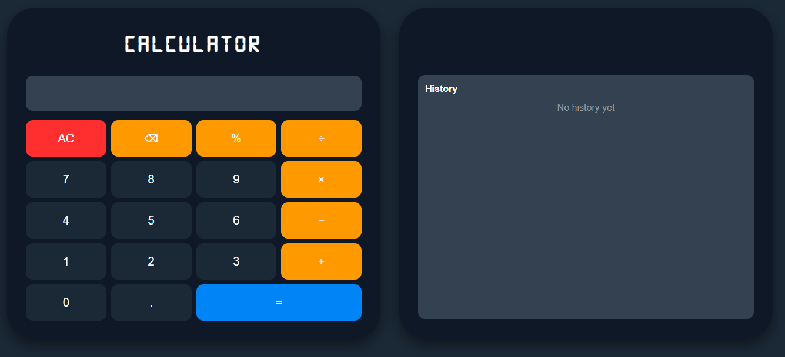
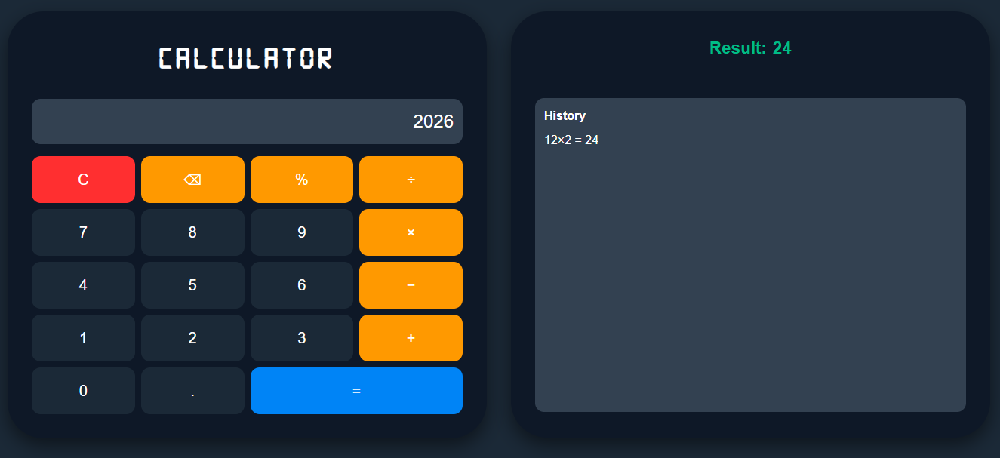

# Smart Calculator (Flask Web App)

## Description
This is a web-based **Smart Calculator** built using Flask. It allows users to perform mathematical operations through an interactive UI and keeps a history of previous calculations.

The project demonstrates backend logic using Python, frontend design using HTML/CSS, and dynamic interaction using JavaScript.

## Features
-  Perform basic arithmetic operations (+, −, ×, ÷, %)
-  Real-time input handling with operator validation
-  Displays calculation results instantly
-  Stores calculation history
-  Clear display (C) and clear history (AC) functionality
-  Responsive design (works on desktop and mobile)

## Technologies Used
- Python
- Flask
- HTML
- CSS (Tailwind + Custom Styling)
- JavaScript


## Project Structure
project-folder/
│── app.py # Main Flask application
│── calculator.py # Core calculation logic (OOP)
│
├── templates/
│ └── index.html # Frontend UI
│
├── static/
│ ├── style.css # Styling
│ ├── script.js # Frontend logic
│ └── fonts/
│ └── Digital-7.ttf # Custom calculator font

## Installation & Setup

### 1. Clone the repository
```bash
git clone https://github.com/Melo-dev24/smart-calculator.git
cd smart-calculator
```
### 2. Install dependencies
&nbsp; pip install flask   

### 3. Run the application
&nbsp; python app.py   

### 4. Open in browser
&nbsp; http://127.0.0.1:5000/

## How it works
1. User inputs a mathematical expression using the calculator UI

2. JavaScript handles input validation and symbol conversion

3. Flask receives the input via POST request

4. The backend processes the expression using Python

5. Result is displayed and stored in history

## Example

1. 


2. 


## Author
- John Melo Gonato
- https://github.com/Melo-dev24

